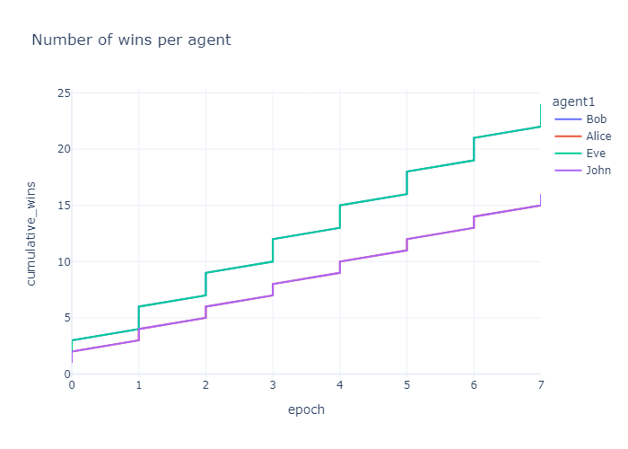

# Argumentation-based Negotiation 

## Introduction

This project implements a negotiation protocol based on the proposed argumentation framework. 

Our agents are able to:
- Communicate between each other
- Propose an engine
- Accept or refuse an engine
- Enter in a negotiation
- Counter-argue on an engine choice

### Setup

You must clone this repository

    git clone https://github.com/alexfrst/ArgumentationBasedNegotiation.git

Then install requirements

    pip install -r requirements.txt

### Runnable scripts

You can run a negotiation with the following command:

    python pwArgumentAgent.py

You can run negotiation in batch with stats computing with the folowing command:

    python pwArgumentAgentBatch.py    

# Technical details

## Architecture
```
│   .gitignore
│   pwArgumentAgent.py
│   pwArgumentAgentBatch.py
│   README.md
│   requirements.txt
│
├───arguments
├───communication
│   ├───agent
│   ├───mailbox
│   ├───message
│   └───preferences
├───data
└───figures
```

- `pwArgumentAgent.py` Contains all the argumentation and interaction logic between agents.
- `pwArgumentAgentBatch.py` Runs simulations in batch to make stats.
- `arguments/` is a wrapper around the argumentation low level classes.
- `communication/` contains the communication logic.
- `data/` contains the agents preference profiles.
- `figures/` contains the figures and the stats of models.

## Implementation details
The most interesting part of this project is the implementation of the negotiation protocol in the `pwAgentArgument` file.
We have added some attributes:
- counter_arguments: that stores the counter-arguments already given for a given item.
- arguments: that stores the pro-arguments already given for a given item.  

The step function dispatches treatment of the incoming message depending on the type of the message (PROPOSE, ASK_WHY, COMMIT, ...).

To avoid loops in the negotiation process, we have added some rules: 
- An item can be proposed only once
- While negotiating for an item, an agent can talk about criterion once.

## Agents

We have four agents, Alice, Bob, Eve and John. We made them argue two by two and we have assessed their performance. You can find their performance and the performance of the items.

## Performance of the agents:



## Perfomance if the items:


